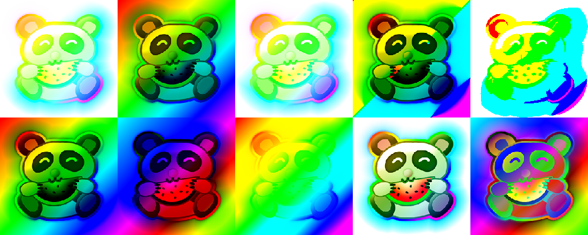

Get ready to push the boundaries of what's possible on the web! PixiJS v8 has landed, and it's a game-changer. Celebrating a decade of driving innovation, we've supercharged PixiJS with the latest technological advancements, making it faster, more robust, and ridiculously powerful. From the seamless integration of WebGPU to leveraging modern JavaScript for smoother development, PixiJS v8 is all about empowering you to create jaw-dropping web experiences with ease. It's not just an update; it's the future of 2D web graphics, today. Dive in and let PixiJS v8 elevate your projects to unseen heights. Let's make the web a more beautiful place, one pixi(el) at a time.

<!--truncate-->

## 🚀 Revolutionizing Web Graphics: Welcome to PixiJS v8


It's hard to believe that PixiJS has been part of the open-source community for a whopping ten years. In that time, the digital landscape has evolved tremendously, and so has PixiJS. We've seen significant updates, like the transition to TypeScript, and we've overhauled major parts of the engine, such as asset loading and WebGL integration.

Now, we're thrilled to unveil PixiJS v8, arguably our most substantial update ever. This release is not just a reflection on the shortcomings of v7, which has served us well, but an acknowledgment that there's always room for improvement. Over time, we've all encountered aspects of our code we wished we could refine. Often, the best solutions and insights emerge only after we've stepped back from the problem, allowing us to see the bigger picture.

With PixiJS v8, our aim was to revisit and enhance the foundation of PixiJS, streamlining its core rather than just adding layers of code.

Our vision for v8 was clear:
- **Longevity:** We designed v8 to stand the test of time, anticipating it will remain relevant and robust for another decade.
- **Innovation with WebGPU:** Embracing the latest in rendering technology, we've seamlessly integrated WebGPU, not as an add-on to our existing WebGL renderer but as a core paradigm, ensuring PixiJS remains at the cutting edge as WebGL phases out.
- **Leveraging Modern JavaScript:** The advancements in JavaScript have significantly simplified development. We've utilized features like object destructuring and options to make v8 cleaner and more powerful.
- **Correcting Past Oversights:** Every project has its lessons. With v8, we've addressed and rearchitected certain aspects of PixiJS, reducing complexity and enhancing functionality, particularly in areas we felt were overengineered in the past (looking at you, textures!).
- **Boosting Performance:** PixiJS is already renowned for its speed. With v8, we've unlocked even greater performance, making it faster across the board compared to v7.

We're incredibly proud of PixiJS v8 and eager to share the improvements and new features with you. While there are some breaking API changes, we've provided a migration guide and ensured compatibility with v7 wherever possible. Get ready to experience the next level of 2D rendering with PixiJS v8!

---

## 🔗 Quick links
- The new Docs for v8 can be found [here](https://pixijs.download/v8.0.0/docs/index.html)
- [Migration](8.x/guides/migrations/v8)
- [Examples](8.x/examples)
- [Open Games](https://github.com/pixijs/open-games)

---

## 🎁 Whats New?
There are numerous updates to discuss, more than can be covered in a single post! Below are the key highlights. For a more detailed exploration of these changes, be sure to follow the links provided above.

#### 📈 New Performance Bar


The performance of v8 is faster for **both** renderers. This means by using v8 and the WebGL renderer, all the speed improvements apply! This is mainly as we have taken great care to make a more reactive render loop that only updates what it needs to. Check out the numbers here:

- **CPU** = time spent by the CPU rendering a single frame
- **GPU** = time spent by the GPU rendering a single frame

| Bunny Situation | V7 CPU  | V8 CPU |CPU Dif | V7 GPU | V8 GPU | GPU dif |
|-----------------|------------|------------|--------------------|------------|------------|--------------------|
| 100k sprites all moving | ~50ms | ~15ms | <div style={{backgroundColor:'lightgreen', color:'black'}}>233%</div> | ~9ms | ~2ms | <div style={{backgroundColor:'lightgreen', color:'black'}}>350%</div> |
| 100k sprites not moving | ~21ms | ~0.12ms | <div style={{backgroundColor:'lightgreen', color:'black'}}>17417%</div> | ~9ms | ~0.5ms | <div style={{backgroundColor:'lightgreen', color:'black'}}>1700%</div> |
| 100k sprites (changing scene structure) | ~50ms | ~24ms | <div style={{backgroundColor:'lightgreen', color:'black'}}>108%</div> | ~9ms | ~2ms | <div style={{backgroundColor:'lightgreen', color:'black'}}>350%</div> |

These benchmark numbers are based on the Bunnymark test that you can try yourself.

- [v7 Bunnymark](https://goodboydigital.github.io/pixi-bunnymark/dist/?version=v7&count=100000&renderer=webgpu)
- [v8 Bunnymark - WebGPU](https://goodboydigital.github.io/pixi-bunnymark/dist/?version=v8&count=100000&renderer=webgpu)
- [v8 Bunnymark - WebGL](https://goodboydigital.github.io/pixi-bunnymark/dist/?version=v8&count=100000&renderer=webgl)
- [Repo](https://github.com/GoodBoyDigital/pixi-bunnymark)

#### 🖥️ WebGPU Renderer


We've implemented a WebGPU backend for rendering. Whilst this has created a better graphics paradigm under the hood and set us up for the future of rich web content, it's important to note that WebGPU does not automatically guarantee improved performance over WebGL in all scenarios, as PixiJS often encounters more limitations on the CPU side than the GPU. However, for scenes with numerous batch breaks, such as filters, masks, and blend modes, WebGPU may offer better performance due to its more modern to rendering. As WebGPU is relatively new, it's expected to enhance in speed over time, similar to the development of WebGL. It serves as a solid foundation for future advancements.


#### 📦 New Package Structure

No more "lerna." PixiJS is now just one package with one import root: `import {stuff} from ‘pixi.js’`. This change means we now have much better tree shaking during app compilation, reducing bundle size if not imported.

Old:

```ts
import { Sprite } from "@pixi/sprite";
import { Graphic } from "@pixi/graphics";
```

New:

```ts
import { Sprite, Graphic } from "pixi.js";
```

### ✨ We *promise* the Renderer will work

When initializing a renderer, this process is now asynchronous. This serves two purposes: firstly, identifying and loading the necessary renderer code to minimize what is loaded for your users. We only load the one backend that your user is using. There's no point in loading all the WebGL stuff if they are using WebGPU. Secondly, the initialization of WebGPU itself is an asynchronous process, so we need to have a promise in there somewhere!

```ts
import { Application, autoDetectRenderer } from "pixi.js";

const app = new Application();

(async () => {
  await app.init({
    // application options
  });

  // or
  const renderer = await autoDetectRenderer({}); // WebGL or WebGPU

  // do pixi things
})();
```


#### 🌟 Scene Upgrades



- The concept of render groups has been introduced, enabling containers to utilize GPU for their transformations. This facilitates a true 2D hardware-accelerated camera, ideal for navigating large static worlds through panning and zooming, similar to how a camera moves in a 3D environment rather than moving the world itself. This approach can significantly enhance performance.

```ts
const container = new Container({
  isRenderGroup:true // this containers transform is now handled on the GPU!
})
```

- Another cool new change is that now blend modes and tints are inherited, much like transforms and alpha. This means you can now easily tint a container, and all its children will have the tint applied - same for blend modes, its as easy as:

```
// will make all the children tinted red
container.tint = 'red'
// will make all the children have the add blend mode
container.blendMode = 'add'
```

Rendering to a texture with antialiasing has been simplified; you only need to enable the new antialiasing property by setting it to true during the creation of a render texture or when applying a filter, similar to the process used for creating your renderer.

```
const texture = RenderTexture.create({
    width:100,
    height:100,
    antialias:true // easy as that
})
```

- We have also added support for a wide range of Photoshop-like filters, This allows you to take your rendering to the next level! We have including all the classics:
  - ColorBlend, ColorBurnBlend, ColorDodgeBlend, DarkenBlend, DifferenceBlend, DivideBlend, ExclusionBlend, HardLightBlend, HardMixBlend, LightenBlend, LinearBurnBlend, LinearDodgeBlend, LinearLightBlend, LuminosityBlend, NegationBlend, OverlayBlend, PinLightBlend, SaturationBlend, SoftLightBlend, SubtractBlend, VividLightBlend.
 - It's important to mention that these are essentially filters at the core, so it's advisable not to overuse them to avoid potential slowdowns.

```ts
import `pixi.js/advanced-blend-modes` // make sure to include them in you lib! (or cherry pick one!)

myContainer.blendMode = 'color-burn` // easy!
```

#### 🎨 Graphics Upgrades


- The Graphics API has undergone changes to become more intuitive and user-friendly, closely resembling the HTML Canvas 2D context API. For instance, drawing and filling a rectangle is simplified as follows:

  ```ts
  graphics
      .rect(50, 50, 100, 100)
      .fill('blue');
  ```

- A `GraphicsContext` has been introduced, powering all graphics operations. Similar to how one texture can be used across many sprites, a single GraphicsContext can now be utilized by multiple Graphics objects, enhancing efficiency and flexibility.

- Support for SVG drawing has been added. For example:

  ```ts
  graphics.svg('M 100 350 q 150 -300 300 0');
  ```

- Gradient fill support has been introduced, currently limited to linear gradients, allowing for more visually engaging designs.

- The new `GraphicsPath` class enables the drawing and sharing of shapes. This feature is particularly useful as it allows for the creation of paths that can then be transformed into Mesh geometry using the `buildGeometryFromPath` function, opening up new possibilities for intricate and detailed graphic designs.

```
  const path = new GraphicsPath()
      .rect(-50, -50, 100, 100)

  // create geometry from the path:
  const geometry = buildGeometryFromPath({
      path,
  });

  const mesh = new Mesh({
      geometry,
      texture: Texture.WHITE,
  });

```

For more information on these graphics upgrades and guidance on how to adapt to the enhanced Graphics API, please refer to the [migration guide](/8.x/guides/migrations/v8), or why not jump in and play with some [examples](8.x/examples/graphics/simple).

#### 📝 Text Upgrades

Text has been upgraded to allow for better performance and usability! We have also integrated HTMLText into v8 as standard.

BitmapFonts can now be generated on the fly or installed upfront as you prefer. They dynamically add characters as the font's glyphs are required, saving on memory. The layout of bitmap text is almost identical to the layout of the default text now, making it easier to switch between the two depending on your needs.

```ts

const myText = new BitmapText({
  text: 'hello im a bitmap font!',
  // font will be dynamically created
  style:{
    fontFamily: 'Outfit',
    fontSize: 12,
    fill: 'red',
  }
})
```
Text fills and strokes now conform to the same fills and strokes as graphics. This means Gradients, textures, and all the fun ways you can fill and stroke graphics can now be applied to Text.

```ts
const myText = new Text({
  text: 'hello im some fancy text',
  // font will be dynamically created!
  style:{
    fontFamily: 'Outfit',
    fontSize: 12,
    fill: { texture, color:'red'} // same as graphics api fills
    stroke: { width:3, color:'blue' } // same as graphics api strokes
  }
})
```


## 🤝 What now? Get involved!

As PixiJS v8 takes its first steps into the world, we're eager to see it grow with your feedback and contributions. Now we know things won't be perfect, but we're committed to quick responses on [GitHub](https://github.com/pixijs/pixijs) and [Discord](https://discord.gg/nrnDP9wtyX) to any issues that arise, valuing your input to make PixiJS even better.

A heartfelt thanks to our early adopters (everyone in [here](https://discord.com/channels/734147990985375826/1143191340230914068)) for testing the limits of v8, to our dedicated contributors and team for their hard work. Your efforts and insights are invaluable to us. We could not have gotten here without you!

A final big shout-out to PlayCo for their support in making this release a reality!

Let's continue to innovate and push the boundaries of web graphics together. Your engagement is key to PixiJS's evolution, and we're excited to see where we can go with your help.

## 📲 Keep in touch

To stay in the loop, we invite you to follow [Doormat23](https://twitter.com/Doormat23) and [PixiJS](https://twitter.com/PixiJS) on social media, where we'll be unveiling more exciting updates shortly. Alternatively, you can join our vibrant community on [Discord](https://discord.gg/nrnDP9wtyX) for direct engagement and real-time chit-chats.
