# Graphics Fill

If you are new to graphics, please check out the [graphics guide](./graphics) here. This guide dives a bit deeper into a specific aspect of graphics: how to fill them! The `fill()` method in PixiJS is particularly powerful, enabling you to fill shapes with colors, textures, or gradients. Whether you're designing games, UI components, or creative tools, mastering the `fill()` method is essential for creating visually appealing and dynamic graphics. This guide explores the different ways to use the `fill()` method to achieve stunning visual effects.

:::info Note
The `fillStyles` discussed here can also be applied to Text objects!
:::

## Basic Color Fills

When creating a `Graphics` object, you can easily fill it with a color using the `fill()` method. Here's a simple example:

```ts
const obj = new Graphics()
  .rect(0, 0, 200, 100) // Create a rectangle with dimensions 200x100
  .fill('red'); // Fill the rectangle with a red color
```


This creates a red rectangle. PixiJS supports multiple color formats for the `fill()` method. Developers can choose a format based on their needs. For example, CSS color strings are user-friendly and readable, hexadecimal strings are compact and widely used in design tools, and numbers are efficient for programmatic use. Arrays and Color objects offer precise control, making them ideal for advanced graphics.

- CSS color strings (e.g., 'red', 'blue')
- Hexadecimal strings (e.g., '#ff0000')
- Numbers (e.g., `0xff0000`)
- Arrays (e.g., `[255, 0, 0]`)
- Color objects for precise color control

### Examples:

```ts
// Using a number
const obj1 = new Graphics().rect(0, 0, 100, 100).fill(0xff0000);

// Using a hex string
const obj2 = new Graphics().rect(0, 0, 100, 100).fill('#ff0000');

// Using an array
const obj3 = new Graphics().rect(0, 0, 100, 100).fill([255, 0, 0]);

// Using a Color object
const color = new Color();
const obj4 = new Graphics().rect(0, 0, 100, 100).fill(color);
```

## Fill with a Style Object

For more advanced fills, you can use a `FillStyle` object. This allows for additional customization, such as setting opacity:

```ts
const obj = new Graphics().rect(0, 0, 100, 100)
  .fill({
    color: 'red',
    alpha: 0.5, // 50% opacity
  });
```
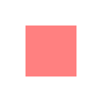

## Fill with Textures

Filling shapes with textures is just as simple:

```ts
const texture = await Assets.load('assets/image.png');
const obj = new Graphics().rect(0, 0, 100, 100)
  .fill(texture);
```

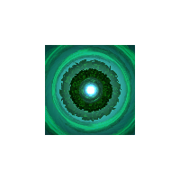

### Local vs. Global Texture Space

Textures can be applied in two coordinate spaces:

- **Local Space** (Default): The texture coordinates are mapped relative to the shape's dimensions and position. The texture coordinates use a normalized coordinate system where (0,0) is the top-left and (1,1) is the bottom-right of the shape, regardless of its actual pixel dimensions. For example, if you have a 300x200 pixel texture filling a 100x100 shape, the texture will be scaled to fit exactly within those 100x100 pixels. The texture's top-left corner (0,0) will align with the shape's top-left corner, and the texture's bottom-right corner (1,1) will align with the shape's bottom-right corner, stretching or compressing the texture as needed.
  
```ts
const shapes = new PIXI.Graphics()
    .rect(50,50,100, 100)
    .circle(250,100,50)
    .star(400,100,6,60,40)
    .roundRect(500,50,100,100,10)
    .fill({
        texture,
        textureSpace:'local' // default!
    });
```

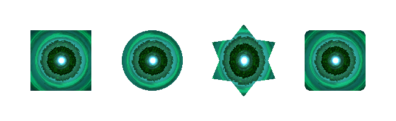

- **Global Space**: Set `textureSpace: 'global'` to make the texture position and scale relative to the Graphics object's coordinate system. Despite the name, this isn't truly "global" - the texture remains fixed relative to the Graphics object itself, maintaining its position even when the object moves or scales. See how the image goes across all the shapes (in the same graphics) below:

```ts
const shapes = new PIXI.Graphics()
    .rect(50,50,100, 100)
    .circle(250,100,50)
    .star(400,100,6,60,40)
    .roundRect(500,50,100,100,10)
    .fill({
        texture,
        textureSpace:'global'
    });
```

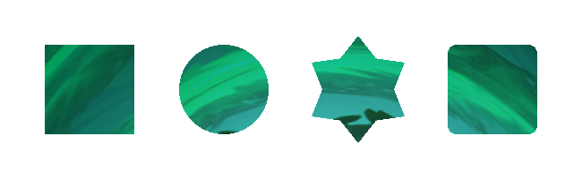

### Using Matrices with Textures

To modify texture coordinates, you can apply a transformation matrix, which is a mathematical tool used to scale, rotate, or translate the texture. If you're unfamiliar with transformation matrices, they allow for precise control over how textures are rendered, and you can explore more about them [here](https://learnwebgl.brown37.net/10_surface_properties/texture_mapping_transforms.html#:~:text=Overview%C2%B6,by%2D4%20transformation%20matrix).

```ts
const matrix = new Matrix().scale(0.5, 0.5);

const obj = new Graphics().rect(0, 0, 100, 100)
  .fill({
    texture: texture,
    matrix: matrix, // scale the texture down by 2
  });
```

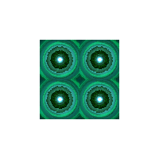

### Texture Gotcha's

1. **Sprite Sheets**: If using a texture from a sprite sheet, the entire source texture will be used. To use a specific frame, create a new texture:

```ts
const spriteSheetTexture = Texture.from('assets/my-sprite-sheet.png');
const newTexture = renderer.generateTexture(Sprite.from(spriteSheetTexture));

const obj = new Graphics().rect(0, 0, 100, 100)
  .fill(newTexture);
```

2. **Power of Two Textures**: Textures should be power-of-two dimensions for proper tiling in WebGL1 (WebGL2 and WebGPU are fine).

## Fill with Gradients

PixiJS supports both linear and radial gradients, which can be created using the `FillGradient` class. Gradients are particularly useful for adding visual depth and dynamic styling to shapes and text.

### Linear Gradients

Linear gradients create a smooth color transition along a straight line. Here is an example of a simple linear gradient:

```ts
const gradient = new FillGradient({
  type: 'linear',
  colorStops: [
    { offset: 0, color: 'yellow' },
    { offset: 1, color: 'green' },
  ],
});

const obj = new Graphics().rect(0, 0, 100, 100)
  .fill(gradient);
```

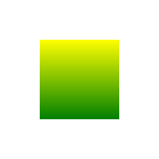

You can control the gradient direction with the following properties:

- `x0`, `y0`: These define the starting point of the gradient. For example, in a linear gradient, this is where the first color stop is positioned. These values are typically expressed in relative coordinates (0 to 1), where `0` represents the left/top edge and `1` represents the right/bottom edge of the shape.

- `x1`, `y1`: These define the ending point of the gradient. Similar to `x0` and `y0`, these values specify where the last color stop is positioned in the shape's local coordinate system.

Using these properties, you can create various gradient effects, such as horizontal, vertical, or diagonal transitions. For example, setting `x0` to `0`, `y0` to `0`, `x1` to `1`, and `y1` to `1` would result in a diagonal gradient from the top-left to the bottom-right of the shape.

```ts
const diagonalGradient = new FillGradient({
  type: 'linear',
  x0: 0, y0: 0, x1: 1, y1: 1,
  colorStops: [
    { offset: 0, color: 'yellow' },
    { offset: 1, color: 'green' },
  ],
});
```

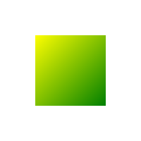

### Radial Gradients

Radial gradients create a smooth color transition in a circular pattern. Unlike linear gradients, they blend colors from one circle to another. Here is an example of a simple radial gradient:

```ts
const gradient = new FillGradient({
  type: 'radial',
  colorStops: [
    { offset: 0, color: 'yellow' },
    { offset: 1, color: 'green' },
  ],
});

const obj = new Graphics().rect(0, 0, 100, 100)
  .fill(gradient);
```

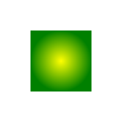

You can control the gradient's shape and size using the following properties:

- `x0`, `y0`: These define the center of the inner circle where the gradient starts. Typically, these values are expressed in relative coordinates (0 to 1), where `0.5` represents the center of the shape.

- `r0`: The radius of the inner circle. This determines the size of the gradient's starting point.

- `x1`, `y1`: These define the center of the outer circle where the gradient ends. Like `x0` and `y0`, these values are also relative coordinates.

- `r1`: The radius of the outer circle. This determines the size of the gradient's ending point.

By adjusting these properties, you can create a variety of effects, such as small, concentrated gradients or large, expansive ones. For example, setting a small `r0` and a larger `r1` will create a gradient that starts does not start to transition until the inner circle radius is reached.

```ts
const radialGradient = new FillGradient({
  type: 'radial',
  x0: 0.5, y0: 0.5, r0: 0.25,
  x1: 0.5, y1: 0.5, r1: 0.5,
  colorStops: [
    { offset: 0, color: 'blue' },
    { offset: 1, color: 'red' },
  ],
});

const obj = new Graphics().rect(0, 0, 100, 100)
  .fill(gradient);
```

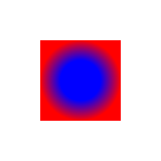

### Gradient Gotcha's

1. **Memory Management**: Use `fillGradient.destroy()` to free up resources when gradients are no longer needed.

2. **Animation**: Update existing gradients instead of creating new ones for better performance.

3. **Custom Shaders**: For complex animations, custom shaders may be more efficient.

4. **Texture and Matrix Limitations**: Under the hood, gradient fills set both the texture and matrix properties internally. This means you cannot use a texture fill or matrix transformation at the same time as a gradient fill.

### Combining Textures and Colors
You can combine a texture or gradients with a color tint and alpha to achieve more complex and visually appealing effects. This allows you to overlay a color on top of the texture or gradient, adjusting its transparency with the alpha value. 

```ts

const gradient = new FillGradient({
    colorStops: [
        { offset: 0, color: 'blue' },
        { offset: 1, color: 'red' },
    ]
});

const obj = new Graphics().rect(0, 0, 100, 100)
  .fill({
    fill: gradient,
    color: 'yellow',
    alpha: 0.5,
  });

```

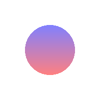

```ts
const obj = new Graphics().rect(0, 0, 100, 100)
  .fill({
    texture: texture,
    color: 'yellow',
    alpha: 0.5,
  });

```

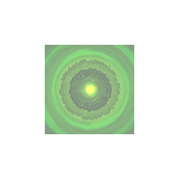

---

Hopefully, this guide has shown you how easy and powerful fills can be when working with graphics (and text!). By mastering the `fill()` method, you can unlock endless possibilities for creating visually dynamic and engaging graphics in PixiJS. Have fun!

